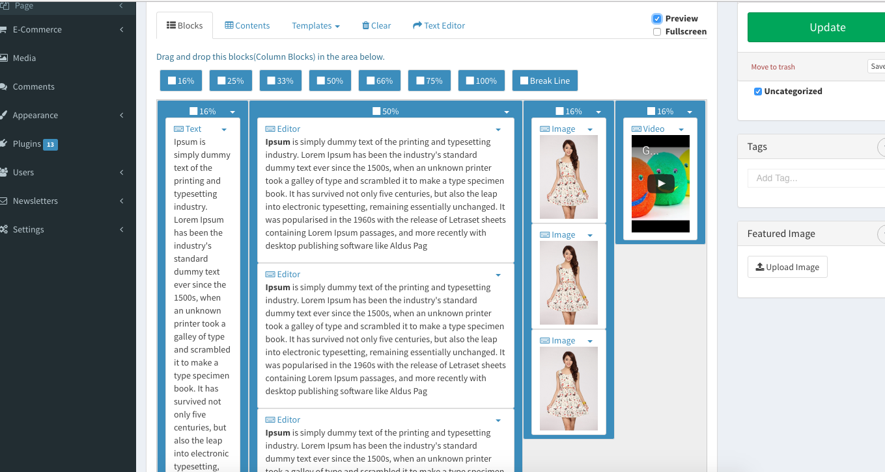

# CamaleonEditor - Camaleon CMS Plugin

A visual drag-and-drop grid/content editor plugin for [Camaleon CMS](https://github.com/owen2345/camaleon-cms):
it adds a "Grid Editor" mode to the admin post editor, reusable grid templates, and a `grid_editor`
frontend shortcode.



## More Information:
https://camaleon.website/store/plugins/camaleon_editor

## Permissions

The plugin adds two role permissions under **Admin > Users > Roles**, both off by default
(administrators always have them):

- **Grid Editor** — use the editor in the post form and apply saved templates. Without it, a user
  gets the plain post editor.
- **Grid templates** — create, edit and delete the site's shared grid templates.

Plugin settings stay under the core **plugins** permission. A role holding neither editor permission
is refused the grid-template endpoints.

## Development

The suite runs against a camaleon_cms-backed dummy Rails app under `spec/` (the Ruby version comes
from `.tool-versions`):

```bash
bundle install
(cd spec/dummy && RAILS_ENV=test bin/rails db:test:prepare)
bin/rspec
```

The `:js` feature specs drive a headless Chrome via Capybara + Selenium; a local Chrome install is
all they need (Selenium Manager resolves a matching chromedriver).

Lint with the same configuration CI enforces:

```bash
bin/rubocop
```

## Releasing

Bump `lib/camaleon_editor/version.rb`, cut a `## <version>` section in `CHANGELOG.md`, merge, then
run the **Release** workflow from the Actions tab on `master`, typing that same version. The
workflow refuses to run without a green CI run for the released commit, publishes the gem to
RubyGems, and creates the tag and GitHub release.
