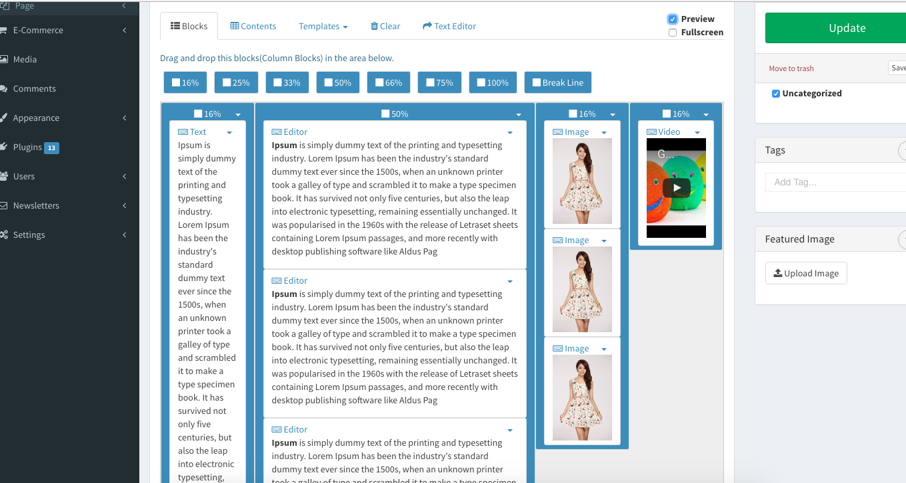

# CamaleonEditor - Camaleon CMS Plugin

A visual drag-and-drop grid/content editor plugin for [Camaleon CMS](https://github.com/owen2345/camaleon-cms):
it adds a "Grid Editor" mode to the admin post editor, reusable grid templates, and a `grid_editor`
frontend shortcode.



## More Information:
https://camaleon.website/store/plugins/camaleon_editor

## Permissions

The plugin adds two role permissions under **Admin > Users > Roles**, both off by default
(administrators always have them):

- **Grid Editor** — use the editor in the post form and apply saved templates. Without it, a user
  gets the plain post editor.
- **Grid templates** — create, edit and delete the site's shared grid templates.

A template is markup the editor puts into the page of whoever applies it. From a **Grid templates**
holder, markup that core refuses as post content (scripts, event handlers, embedded objects) is
refused when the template is saved; it is never rewritten. The editor's own blocks are accepted,
the frame a Video block embeds YouTube or Vimeo in included. Administrators are not scanned, nor is a role core
trusts with unfiltered HTML (**Allow unfiltered HTML in post content**, for any post type). Server-side
code that owns its markup (a seed, an import) opts out with `template.unfiltered_description!`
before saving; without a signed-in author a template is scanned.

Only a template whose markup changes is scanned, so templates stored before the scan existed stay as
they are. To list the stored templates the scan would refuse today (read-only):

```bash
bundle exec rake camaleon_editor:security:scan_templates
```

Plugin settings stay under the core **plugins** permission. A role holding neither editor permission
is refused the grid-template endpoints.

## How a post is saved

**From the grid editor.** The post stores the grid as the grid editor exports it. The text editor
behind the grid editor does not rewrite it.

**From the text editor.** An author who leaves the grid editor for the text editor edits the
markup of the grid there. The post then stores the content of the text editor. A grid opened on
other post content gives that content back to the text editor.

**Back in the grid editor.** The result depends on the changes that the author made in the text
editor:

- No changes: the grid stays as the author left it.
- A changed grid: the grid is built again from it. The post stores that content, as the text
  editor wrote it, until the next change of the grid.
- Other content: there is no grid to build. The grid comes back as the author left it, and the
  post stores the grid. The other content stays in the text editor.

A grid opened on other post content is stored only after its first change. Until then, the post
keeps the content of the text editor.

**Before the page unloads.** Each text editor writes its content into its field, as a save does
(the grid export while the grid editor is visible). Before, TinyMCE wrote the raw markup of the
editor there, and a page that the author did not leave kept that markup in its fields. An editor
that TinyMCE hid, or an editor with the unload write disabled, writes nothing.

### Scripts

On a page that loads the grid editor, the text editors keep the scripts of their content. This
applies to a grid, an Editor block in its form, other post content, and markup written in the
source view.

- Each text editor of the page keeps scripts. This does not depend on its settings. If its list
  of valid elements has a rule for the script element, the editor keeps that rule.
- Pasted markup still loses its scripts.
- A script does not run in the editors. It runs on the public page.
- A text editor returns a script in its position, on its own line, with its text unchanged and
  with no paragraph around it. The attributes come back as the editor writes them (double quotes,
  `async=""`).
- A text editor ends a script at the same closing tag as a browser.
- TinyMCE 4.7.4 or later is necessary. The gem requires it from `tinymce-rails`.

### Permissions for a save

Core applies its rules to changed content, and the text editor's version of a grid is changed
content.

- The grid marker is a shortcode. To save a changed grid, a role needs **Allow shortcodes in
  content**.
- Changed content can have a script: an embed in a Text or Editor block, or a script that the
  text editor kept. Core stores it for an administrator or a role with unfiltered HTML. For other
  roles, core refuses the save with its message.

## Loading the editor on another admin page

The plugin loads the grid editor into the post form by itself. To offer it on a TinyMCE field of
another admin page (a theme settings page, another plugin's form), call the plugin's helper from
that page's controller or view, after checking the user may use the editor:

```ruby
camaleon_editor_append_editor_assets if can?(:manage, Plugins::CamaleonEditor::MainHelper::PERMISSION_USE)
```

The helper appends the editor's scripts and stylesheet, and tells the editor whether the user holds
the **Grid templates** permission, which decides whether **Templates > Save as template** is
offered. A page that appends the asset library directly still works: each time the Templates menu
is opened the editor asks `GET /admin/plugins/camaleon_editor/abilities`, which answers `{"manage_templates": true|false}`
to any user holding either editor permission, and offers the entry only on a `true`. The answer is
not kept, so a permission granted or taken away since shows without a reload.

## Development

The suite runs against a camaleon_cms-backed dummy Rails app under `spec/` (the Ruby version comes
from `.tool-versions`):

```bash
bundle install
(cd spec/dummy && RAILS_ENV=test bin/rails db:test:prepare)
bin/rspec
```

The `:js` feature specs drive a headless Chrome via Capybara + Selenium; a local Chrome install is
all they need (Selenium Manager resolves a matching chromedriver).

Lint with the same configuration CI enforces:

```bash
bin/rubocop
```

## Releasing

Bump `lib/camaleon_editor/version.rb`, cut a `## <version>` section in `CHANGELOG.md`, merge, then
run the **Release** workflow from the Actions tab on `master`, typing that same version. The
workflow refuses to run without a green CI run for the released commit, publishes the gem to
RubyGems, and creates the tag and GitHub release.
